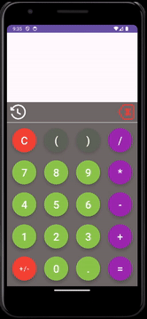

    

# Calculator-app  
 ### *Created by [Michel Robert](https://mrobert12.github.io/Michel-Robert/)*

 ---

 The Calculator App is a user-friendly calculator for Android devices, designed to handle both basic and complex mathematical expressions. The app provides a clean interface, 
 real-time calculation feedback, and a history feature to view your past equations.

## Features

- Basic Operations: Add, subtract, multiply, and divide with ease.
- Postfix Evaluation: Efficient and accurate equation evaluation using a custom implementation of postfix conversion and stack-based computation for correct order of operations.
- Advanced Expressions: Support for parentheses and decimals for accurate and structured calculations.
- Live Preview: View real-time results as you type.
- History Tracking: Access your last five equations for quick reference.
- Error Handling: Prevents invalid inputs and gracefully manages division by zero.
- Formatted Results: Outputs are neatly rounded to avoid overflow or unnecessary decimal places.

## How It Works

1. Inputting Equations: Use the on-screen buttons to create a valid mathematical expression.
2. Real-Time Solutions: See the calculated result in the solution view as soon as the equation is valid.
3. Equation History: Tap the history icon to view past equations and recall them for reuse.
4. Clear Options: Clear current input or the entire history as needed.

## Requirements

- Android OS
- Supports devices with AndroidX and Material Design Components.

    

## Credits
Created with ❤️ by [Michel Robert](https://mrobert12.github.io/Michel-Robert/).  
